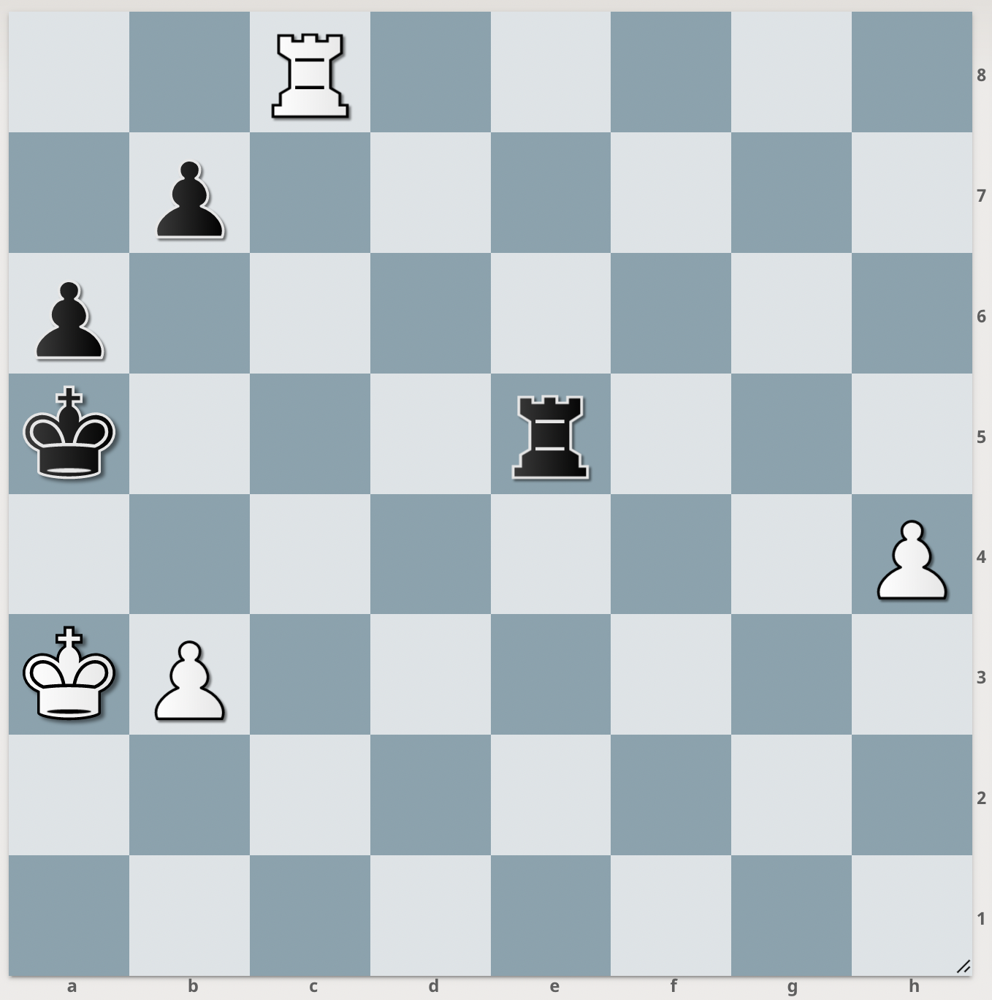
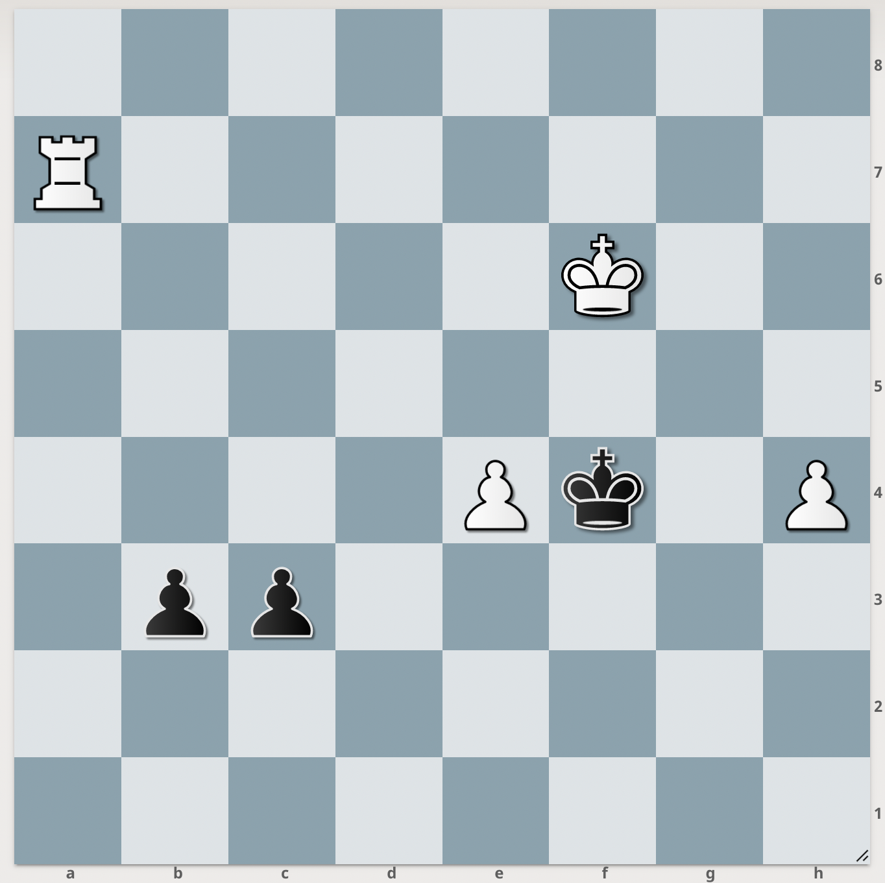

# Analysing 2 billion chess games to determine 7-man Syzygy EGTBs priority

## What are EGTBs?

[Endgame Tablebase](https://en.wikipedia.org/wiki/Endgame_tablebase), or EGTB is a precomputed table of game result evaluations for each legal position that consists of certain pieces. Game analysis engine can query this database instead of evaluating the position which greatly speeds up not only the analysis of positions that are present in EGTB but also the analysis of possible conversions from more complex positions to EGTB positions.

Two types of chess EGTBs exist that are available publicly:

- Nalimov/Lomonosov EGTBs (7-piece): these were computed circa 2013 on Lomonosov supercomputer; they're optimised around giving the shortest path to victory / draw. They're also huge (~140TB) and available to the public only through a Lomonosov website.
- Syzygy EGTBs (7-piece): created by Ronald de Man (aka syzygy); 7-piece EGTBs calculated by Bojun Guo (aka noobpwnftw) on Aug 2018. Syzygy are optimised for playing around 50-move draw rule, converting to simpler positions. They're also optimised for size they occupy on disk. These are available publicly and can be queried through different websites / APIs (e.g. Lichess, [syzygy-tables.info](https://syzygy-tables.info/) that uses Lichess API etc.);  Lichess itself has EGTBs connected to their analysis board.

## Why bother?

If EGTBs are available online, why bother downloading them?

The answer is “speed”. While Lichess allows me to analyse positions with access to full 7-piece Syzygy EGTBs, I can only analyse 1 variation at approximately 2.5MN/s (million nodes per second) running WASM Stockfish 11 in browser on my M1 Air. In comparison, desktop Stockfish 13 app gets 3x that speed and arbitrary number of lines (to some extent). Probing EGTBs over HTTP with those speeds is out of question.

Yet while all the components of the system – Stockfish chess engine, Syzygy EGTBs, decent GUI analysis apps (emphasis on “analysis”) — are available for free, disk space isn't. Below is the space requirements table for full Syzygy EGTBs (courtesy of *syzygy-tables.info*):

|Pieces|WDL|DTZ|Total|
|:----:|:----:|:----:|:----:|
|3-5|378.1 MiB|560.9 MiB|939.0 MiB|
|6|67.8 GiB|81.4 GiB|149.2 GiB|
|7|8.5 TiB|8.3 TiB|16.7 TiB|

(more on WDL and DTZ later)

I can shoulder keeping databases for 3-6 pieces on my laptop (and to think I used to wonder how people filled those 1TB+ SSDs…) but 7-piece ones are out of reach; to those who thought “RAID 10 NAS over GbE etc.” – I'm not printing money, y'know.

## How to prioritise?

First thing first: what are WDL and DTZ?

WDL means “win/draw/loss”. This is the table that stores evaluation for each position that engine can use to make a decision about conversions into simpler positions.

DTZ means “distance to zero (ply count)”. This number tells engine how many half-moves (plies) left till irreversible move (pawn push or capture) needs to be made to play around 50-move draw while still maintaining win/draw chances.

One can say WDL is used to determine *which* positions to play and DTZ – *how* to play those positions. Not exactly what happens but close; also, it's possible to play with WDL EGTBs only, using them to analyse more complex positions for conversion options and later use engine to play the simplified positions. A lot of those positions aren't complex enough to require DTZ info to be played perfectly.

A-a-anyway, after downloading the full 6-piece Syzygy EGTBs I went online to search for opinions and previous analyses for 7-piece Syzygy.

Chess forums were more or less the same with KRPPvKRP, KPPPvKPP and KBPPvKBP being the top 3 suggestions which is understandable: rook and pawn and pure pawn endgames are the most common, and bishops being valued more than knights is nothing new.

Then, I stumbled upon a [Google sheet](https://docs.google.com/spreadsheets/d/1Pz8Jbgh1mIeAgvzL8jCCO-NDb8wAE3RX-dv9yHNrd3s/edit#gid=1364398892) that ranked the 7-piece Syzygy in order of “most positions per GB”. A somewhat useful metric but weird at the same time. KQPPPvKP, who needs EGTB for that?

After some more searching, I went back to a tab with [Lichess database page](https://database.lichess.org/) opened, looked at 512 GB total size and thought “guess I'm doing it the hard way”.

## Teh algoz 'n codez

The initial idea was to prototype the algorithms in Python and then port them to something more performant with the chess libs available (like Rust). Yet after we sat with *mi amigo* one morning and did some preliminary benchmarks while going through out first cup of coffee (so don't trust us too much on this), we arrived at the following estimations:

- compressed files result in about x2-3 performance hit at the cost of saving ~6 times more space (PGNs compress really good)
- iterating through a compressed PGN using Python's `bz2.open` is about 10% slower than unzipping it with `bunzip2` (parallel `pbzip2` exists but I didn't want to unzip them before analysis just yet)
- separating one huge PGN into games (without even saving them onto disk, just parsing) accounts for 60-70% of total execution time.

Struggling with Rust for 30% speed gains for one-shot operation didn't seem like an interesting prospect, so I went with Python since I knew it quite well. Still had to ping my other friend later that night for multiprocessing refresher though because we were stumbling upon some strange issues with how `mp.Queue` worked.

Architecture was simple: input queue for parsed PGNs, bunch of workers that analysed positions from those games and stored the results in the output queue that was consumed by stats collector. Looking on the CPU core loads during the analysis, a wild thought of “probably needed more than one PGN producer” appeared but I was too lazy to profile and re-write this properly ;)

The fun thing was to come up with some evaluation algorithm. But first, a piece of advice to those who work with any data: **know your data before writing code**. Seems obvious but I've seen (and later debugged and corrected) a lot of code that was created with some preconceived notion about the data it was processing and later – fouled by many very bizarre ad-hoc fixes for edge cases that wouldn't even be there in the first place if… aight, end of rant.

PGN files are simple enough and consist of header with lines in square brackets, followed by game log in Standard Algebraic Notation (SAN), separated by an empty line. Header usually consists of several tags (e.g. “Seven Tag Roster”); Lichess earliest games had 15, later extended with tags like `Title` (for titled players: GM, IM, FM etc.) and `Annotator` (games with computer analysis). All in all, PGN header is not a fixed number of fields so it had been treated as such.

The first thing I implemented was ELO filter since who wants to analyse 6v1 positions (“five bishops vat else?”). The games that were missing ELO were treated as not falling into the ELO range. For ELO thresholds, I chose 2000 low (since first Lichess games didn't have too many players over 2000) and 4000 high (just to be sure).

**UPD:** *Lower ELO bound was pushed to 2400 in the latest full re-analysis.*

Next, abandoned games. Abandoned games are games where less than 2 moves had been made (the moves where time control doesn't start yet) so there's no point in trying to analyse those. Lichess data was kind enough to provide `[Termination]` tag which allowed filtering out such games before they appear in the input queue.

Next step was finding games that reached 7-piece positions. At this point, I debated whether to go for 8-9 piece positions instead and try to figure out the captures that transformed them into “true” 7-piece but I gave up that idea in the end as being too complex and error-prone. To find 7-piece positions, I also forwent feeding every game into a move generator; instead, I implemented the idea we had with my coffee partner during the brainstorm — counting captures.

To reach 7-piece position, `32-7=25` captures are required and capture symbol, `x`, is unique in SAN log. The only thing that needed to be done is to clean SAN from various comments in curly braces (annotations, `eval` and `clk` info etc.) as well as variations in parens, leaving only the mainline. I haven't confirmed that variations outside comments actually exist in the Lichess DB but I did run another `re.sub` just in case. Defensive programming and all that; also, move generator parses the PGN in the similar fashion (went on a hunch here but confirmed later) so capture counting should be at least not slower than using move generator.

**UPD:** *This approach will work for Lichess DB because Lichess games do not include variations inside variations (unlike e.g. Mega). Regardless, due to a bug in initial parser, Lichess DB was re-analysed with full move generation instead of capture counting; Mega and Caissa was analysed in the same fashion.*

The first version of this algo used the part of mainline up to an including the 25th capture as an input to move generator and it produced an interesting result on the limited dataset (~11 GB compressed) I used for tests and benchmarks, namely, KRPPvKPP EGTB coming up as the third most common. Ruminating on this, I came onto several possible cases:

- one side hanging a piece
- giving up a piece for passed pawn in pawnful endgame
- **position being in the middle of a piece trade**
- somewhat legit position

Nothing to be done about the first two cases, really, but positions with huge material imbalance can't be simply excluded from analysis because of the last two cases.

The 3rd one is what I ended up implementing into analyser. Since I worked with SAN log as pure text up to this point, without parsing and counting moves, replacing partial mainline with full mainline and the move number to which position should be played was a bit of extra work I decided not to do. Instead, I went with just passing the mainline into analyser and playing it, counting pieces, with one small caveat – counting only after 27 half moves since 25 captures are required and the earliest a capture can happen is 3rd half-move (e.g. Scandinavian Defence, `1. e4 d5 2. exd5`). This is a simple theoretical lower limit which I'm sure can be pushed towards a bigger number.

After 27 half-moves, move generator tracks the number of pieces, finds a 7-piece position and plays another half-move. If position is reduced to 6-piece after that, the game is excluded from analysis as the one that can be played by 6-piece EGTB. If the 7-piece position is the last position in the game (checkmate or resignation happened), the game is also excluded from the analysis. Crude, but I decided players were rational about captures.

The 4th case was an interesting one. Consider the following 2 positions that fall under KRPPvKPP EGTB (white to move in both examples):

**Position A:** 2R5/1p6/p7/k3r3/7P/KP6/8/8 w - - 0 1 

Here, after `1. Rc5+ Rxc5` position converts to 7-piece and the next move is not a capture. However, after the logical `2. b4+ Kb~ 3. bxc5(+)` position converts into a 6-piece. A tactical temporary sacrifice like this one still ends up in the analysis because doing position evaluation with Stockfish for each game is too expensive.

**Position B:** 8/R7/5K2/8/4Pk1P/1pp5/8/8 w - - 0 1

This position exploits a simple knowledge that a lone rook loses against two connected passed pawns on the 6th rank even when it's the side with the rook to move (provided the rook doesn't currently attack one of the pawns). If there's a single useful piece of information to remember from this article, it's this.
Black is winning even though it's White to move and White has material advantage. This is the reason EGTBs for large material imbalance are included in the statistics, even though most positions should be trivial to convert for a side with more material even without EGTB. Because of this case, two statistics lists were made, one being the original list sorted “most number of games” and the other is the same list but sorted by material imbalance first and number of games second.

## Results and conclusions

Nothing surprising happened. Rook-pawn and pure-pawn endgames dominate the statistics. The end.

For me it was mostly about how many games reached 7-piece endgames and gather statistics about positions with low material imbalance but big piece composition imbalance, e.g. four pawns vs a minor piece.

Took a long time with a cloud instance for reasons unknown. I was away from the internet that'd allow me to grab half a TB of files quickly so I went with the fastest and cheapest solution in terms of price and performance.

Results can be found [here](./README.md#TLDR). I plan to update them with each new monthly database and maybe introduce additional tables for 2400+, as well as Mega 2021 and Caissa databases.

**UPD:** *Mega and Caissa added. Also added table with Top-10 EGTBs for each game database.*